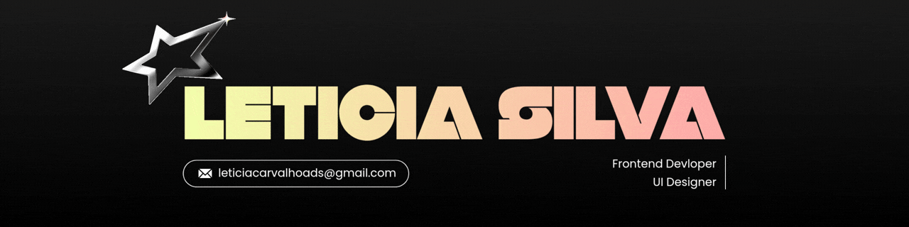

#

  

</h3>

#
 

Sou estudante de <strong>Análise e Desenvolvimento de Sistemas (5º semestre)</strong> no <strong>Instituto Federal de Educação, Ciência e Tecnologia do Ceará (IFCE)</strong>, com foco em desenvolvimento Front-end e criação de interfaces.  Atualmente desenvolvo aplicações utilizando tecnologias web, aplicando conceitos de organização de código, experiência do usuário e design de interfaces.

 

<h2 align="left">Principais Projetos</h2>

• <strong>💳 PayNet</strong> 
Sistema de gerenciamento e pagamento de internet. 
Aplicação para controle de clientes, pagamentos e serviços de provedores de internet.

 

• <strong>💈 Point do Barbeiro</strong> 
Sistema de agendamento para barbearias. 
Aplicação para gerenciamento de serviços, horários e agendamentos, facilitando a organização do atendimento.

 

• <strong>🌱 Cultivo Digital</strong> 
Sistema de gerenciamento agrícola. 
Aplicação voltada para organização e controle de informações relacionadas ao cultivo e atividades agrícolas.

 

<h2 align="left">Área de atuação</h2>

• <strong>💻 Desenvolvimento Front-end</strong> 
Criação de aplicações web utilizando tecnologias modernas, com foco em organização de código, responsividade e boas práticas de desenvolvimento.

 

• <strong>🎨 UI Design</strong> 
Desenvolvimento de interfaces funcionais e intuitivas, buscando uma boa experiência do usuário através de design e usabilidade.

 

<h2 align="left">Tecnologias e Ferramentas</h2>

 

  
  
  
  
  
  
  
  
  
  
  
  
  
  
  
  
  
  
  
  
  

 

<h2 align="left">Contribuições no GitHub</h2>

 

<picture>
  <source media="(prefers-color-scheme: dark)" srcset="https://raw.githubusercontent.com/leticiasilva09/leticiasilva09/output/pacman-contribution-graph-dark.svg">
  <source media="(prefers-color-scheme: light)" srcset="https://raw.githubusercontent.com/leticiasilva09/leticiasilva09/output/pacman-contribution-graph.svg">
  
</picture>

<h2 align="left">📫 Entre em contato</h2>

  

